# T1A2 Porfolio Assignment

### Student: Deandre Sugandhi

[Website](https://deandre-sugandhi-t1-a2.vercel.app/) 
[Github Repo](https://github.com/deandresugandhi/DeandreSugandhi_T1A2)

## Table of Contents
- [Purpose](#purpose)
- [Target Audience](#target-audience)
- [Functionality & Features](#functionality--features)
- [Sitemap](#sitemap)
- [Screenshots](#screenshots)
- [Wireframes](#wireframes)
- [Tech Stack](#tech-stack)

## Purpose
The portfolio website is designed to represent me as an IT professional. It provides the viewers with information about my skills, background, interests, personality, and work. It will be used to communicate my abilities to prospective employers, cllients, or collaborators.

## Target Audience
The target audience are IT professionals looking to collaborate or employers looking to hire a dev or IT professional. They have technical knowledge in IT, software development, and programming languages. They also have certation expectations in relation to professionalism and work ethic.

## Functionality & Features
The site is designed with intuitiveness in mind. I try to make the the separation between different components easy to distinguish for the viewers, as well as communicating clearly to the viewers the purpose, content, and hierarchy of each component through the manipulation of tools such as headings, font sizes, section background colours, font colours, etc. 

I also try to avoid making a clutter on each page to make it easier to read and to create a professional, calm impression. While keeping this in mind, I also wanted to instill some playfulness to the website design, which I have done by adding bright orange to the color scheme, font family selection, text written in a rather casual language, vertical texts and coloured borders, etc. Firstly, my intention to make it more pleasing for the viewers to scan through, so they can have a seamless experience as they shift their focus to reading. Secondly, I wanted to show my personality as both a creative and technical professional.

I paid specific attention to the website's responsive functions, as I noticed how the page would look either too empty or too cluttered on different screens. I try to customize each page's media queries in detail, customizing font size, image size, and layout placement, as each page has unique design and layout of components.

I implemented a hamburger menu for smaller screens, to make the navigation bar less cluttered and to add interactivity. On bigger screens, the navigation bar shifts to a more traditional bar, as I feel there aren't that many links in the nav bar to justify a hamburger menu which might end up becoming a distraction instead. Each link gets underlined and scales up a bit on hover.

The website features five main pages and five blog post pages.

### Homepage
The home page contains a title containing my name, profession, and location. Because the page acts as an introduction to the portfolio website, I made it simple and easy-to-the-eye with no scrolling to avoid overwhelming viewers with information when they first open the page. All the text components use "vw" sizing and margin, so it scales accurately according to screen size. I also added maximum sizes and margins for each media query to avoid the logo from becoming too big.

Under the title, there is a "find out more" hyperlinked text that leads to the "About" page. It scales up a bit and changes color on hover to show that it is a clickable link. The "About" page contains my picture and more information regarding my background and skills, a natural progression from the introductory home page. Viewers can also use the nav bar should they wish to jump around the rest of the pages.

### Experiences
The "Experiences" page contains my educational and professional history. It is divided into three HTML sections, one for education, one for work, and one for my IT-related projects. The information is displayed through the use of two article elements with flexbox layout, namely "Date" and "Description". "Date" is written as a vertically-oriented text next to "Description" which details the education or work history.

On the bottom of the page is a clickable button which downloads my resume on click.

### About
The "About" page provides further information about me, separated into three sections, namely background, skills, and hobbies. 

The background section contains a centred text component and my picture. It describes what I do for the last couple of years, and my decision to study IT.

The skills component contains left-aligned text as well as various articles and divs to showcase my IT skills. These are placeholder contents for the purpose of this assignment.

The hobbies component contains right-aligned text describing my interests.

### Blog
The "Blog" page contains five hyperlinked components each linked to their respective blog posts. Each component consist of an image, a blog title, a sub-heading stating the post's published date and its estimated read time, and a short description of the post's content. These are placeholder contents for the purpose of this assignment. Each component changes colour on hover to indicate that it is a clickable link.

### Contacts
The contact page contains a short message from me, my contact details (phone, email, and address), and a set of icons linking to my social / professional accounts. Each icon changes colour on hover to indicate that they are clickable links.

### Blogposts
The main content of each blogpost page contains the title of the post, a sub-heading stating its published date and estimated read time, an image, and an article. All are placeholder contents for now. 

Under the main content, there is a "Recent Posts" section which contains 4 components linked to 4 of the most recent posts of the blog (excluding the post currently being opened). As there are only 5 blogposts for now, each blogpost have direct access to all the rest of the blogposts. Because these pages are not the main blog page where viewers need to be able to read the full title of the posts, the titles of the blogposts in the "Recent Posts" section are truncated with an ellipsis based on the size of its container, which alters based on screen size.

## Sitemap
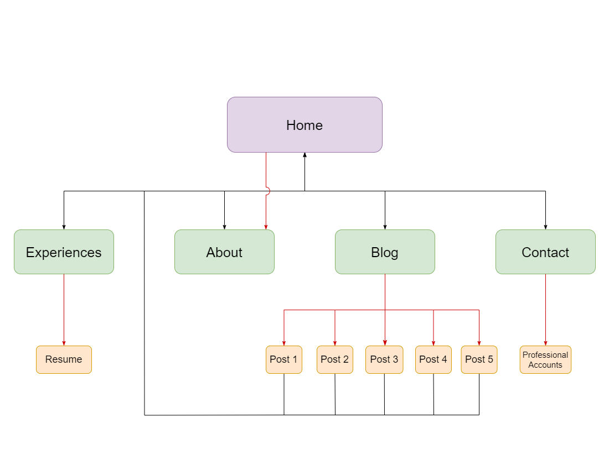
Black arrows indicates links based on navigation bar, red arrows indicate links based on other elements in the page.

## Screenshots
Screenshots are taken full-size.

### Mobile
#### Home
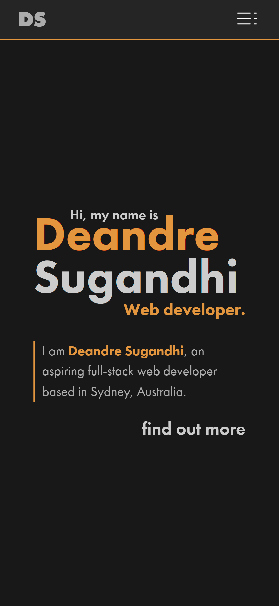
#### Experiences

#### About

#### Blog

#### Contact
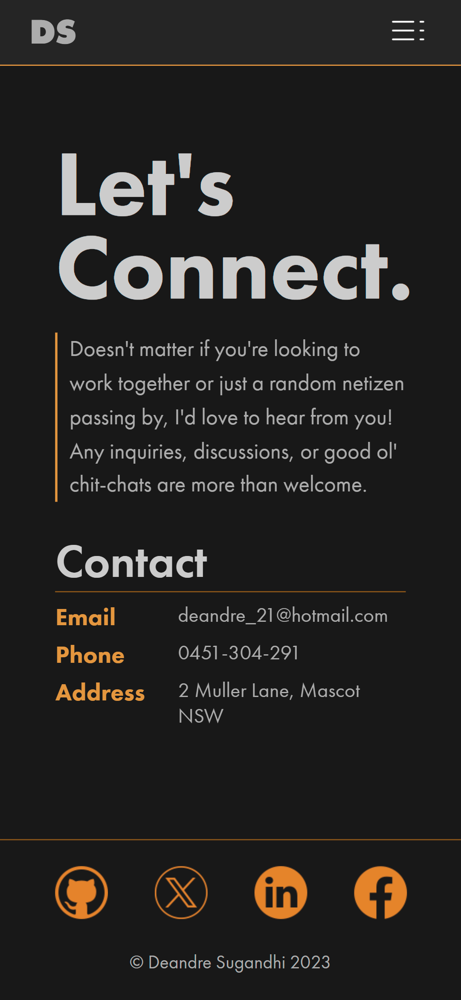
#### Blogpost

### Tablet
#### Home
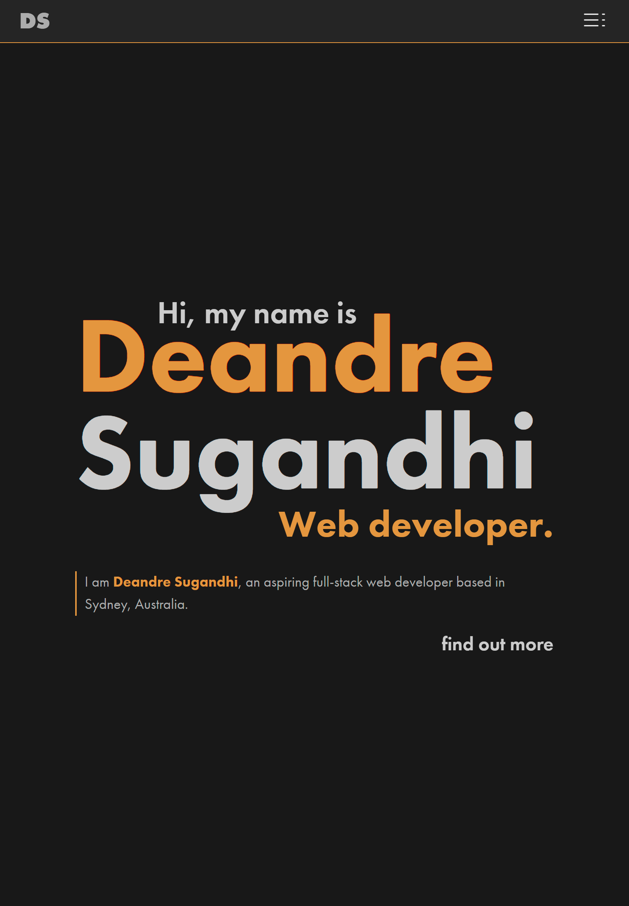
#### Experiences

#### About

#### Blog

#### Contact
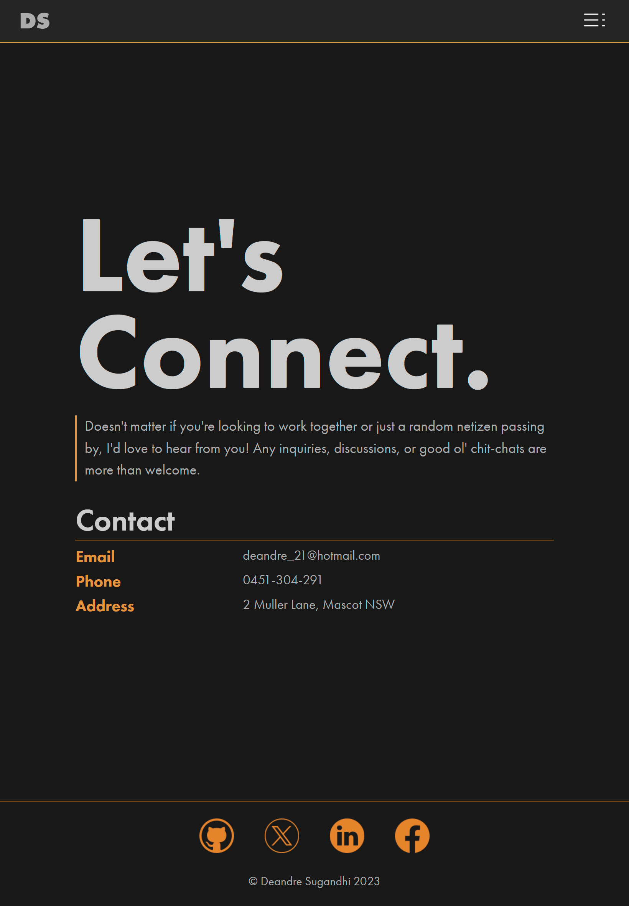
#### Blogpost

### Desktop (1920 x 1080)
#### Home
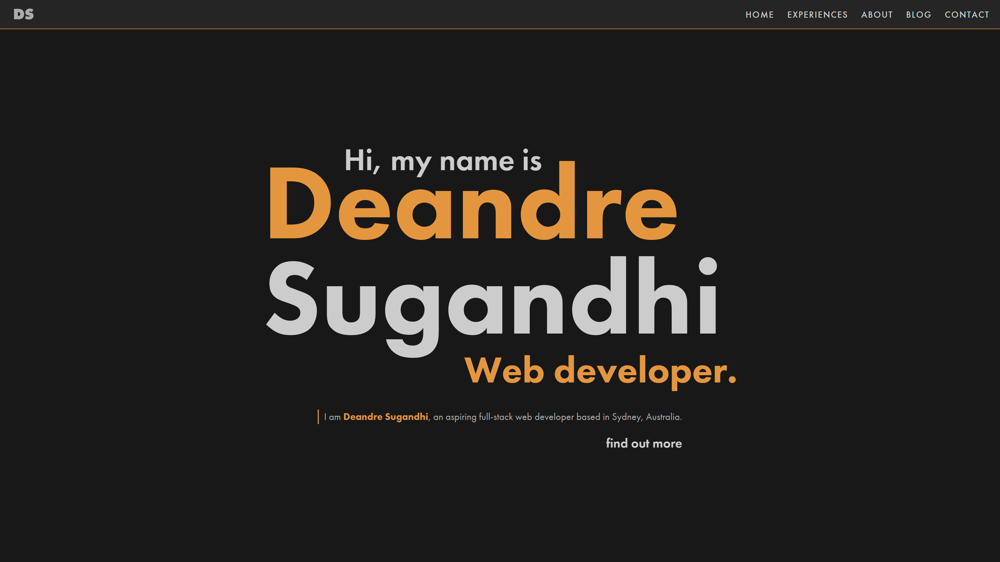
#### Experiences

#### About
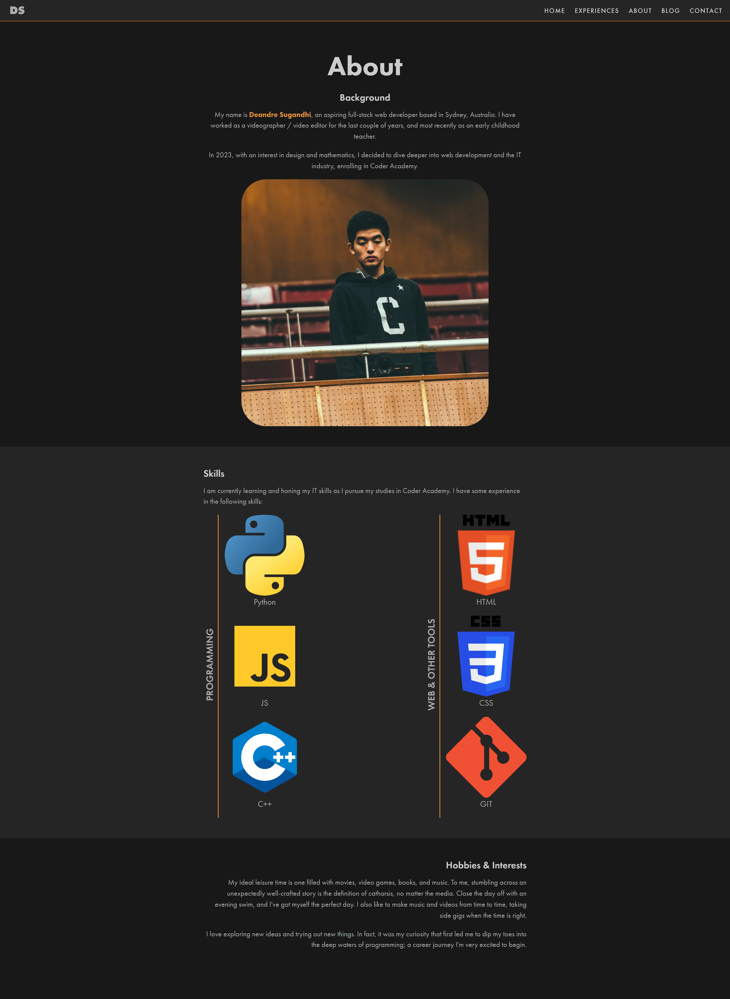
#### Blog

#### Contact
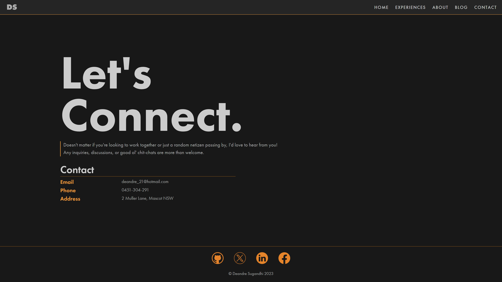
#### Blogpost

## Wireframes
### Mobile
#### Home
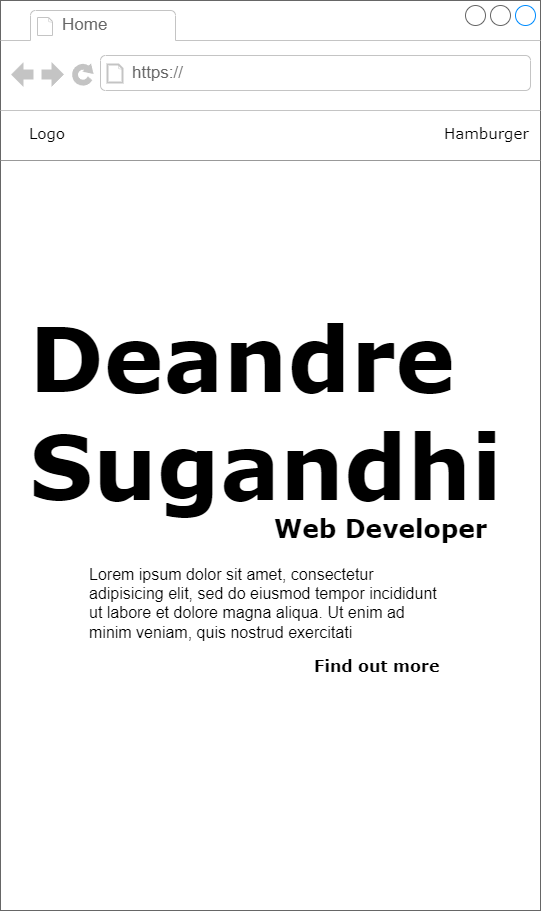
#### Experiences

#### About

#### Blog

#### Contact

#### Blogpost

### Tablet
#### Home

#### Experiences

#### About
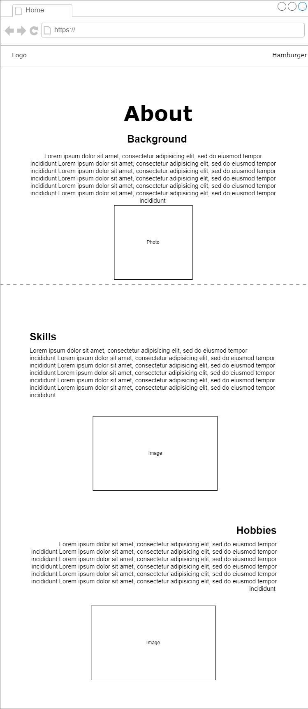
#### Blog

#### Contact
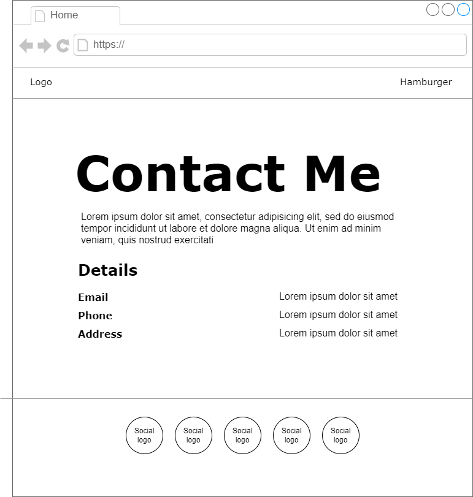
#### Blogpost
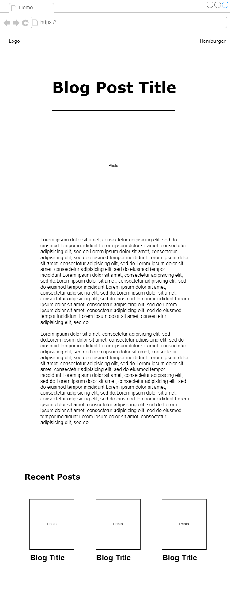

### Desktop (1920 x 1080)
#### Home

#### Experiences
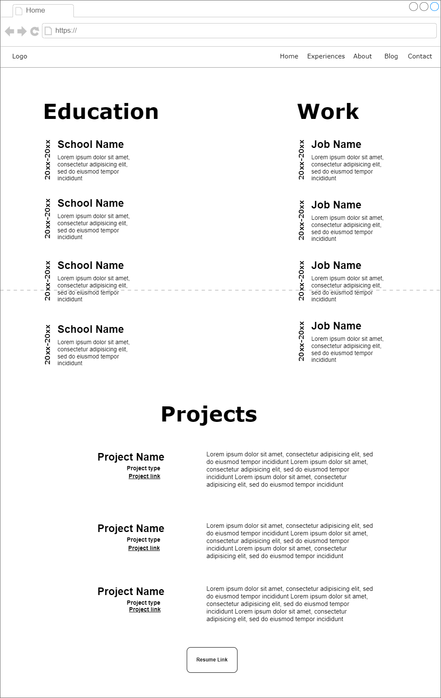
#### About
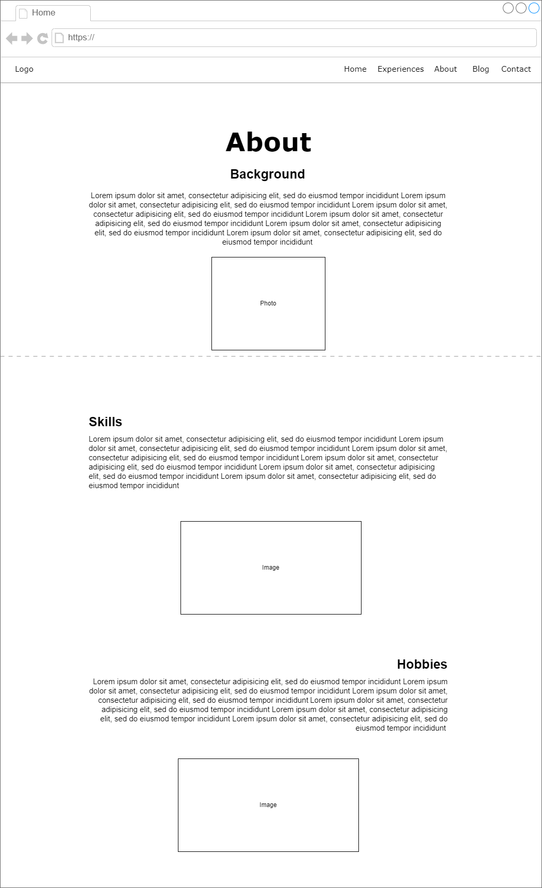
#### Blog

#### Contact
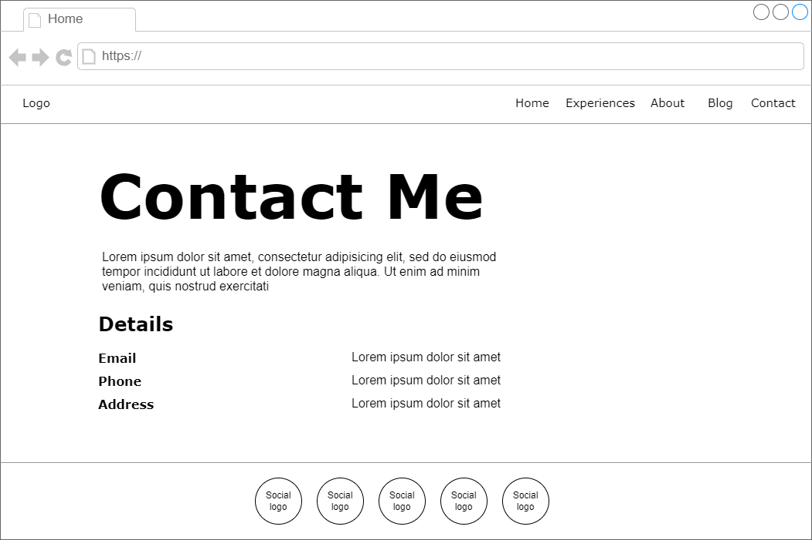
#### Blogpost

## Tech Stack
- Website: HTML, CSS, JavaScript
- Sitemap: [draw.io](https://app.diagrams.net/)
- Wireframe: [draw.io](https://app.diagrams.net/)
- Deployment: [Vercel](https://vercel.com/)
- Slide deck: [Microsoft Power Point](https://www.microsoft.com/en-au/microsoft-365/powerpoint)
- Icons: [Icon Finder](https://www.iconfinder.com/)
- Royalty-Free Stock Images: [Unsplash](https://unsplash.com/)

